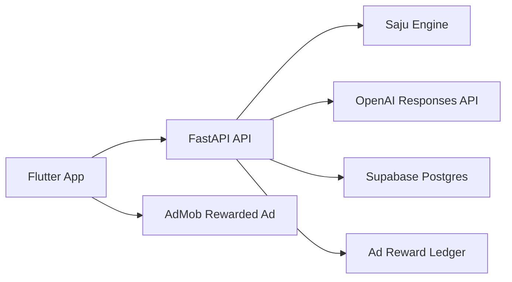

# 사주원해? Technical Architecture

작성 기준일: 2026-06-22

## 1. 권장 스택

- 앱: Flutter
- API 서버: FastAPI
- 데이터베이스: Supabase PostgreSQL
- AI 호출: OpenAI Responses API
- 광고: AdMob Rewarded Ads
- 배포: Google Cloud Run
- 스토리지: Supabase Storage 또는 Cloud Storage

OpenAI 공식 API 문서는 Responses API를 핵심 개념으로 안내하고 있고, 최신 모델 안내 페이지는 `GPT-5.5`를 latest로 표시한다. 이를 바탕으로, 이 앱은 최신 Responses API 기반 설계를 기본으로 잡는 것이 자연스럽다.
출처:
 [OpenAI API docs](https://developers.openai.com/api/docs)
 [OpenAI latest model guide](https://developers.openai.com/api/docs/guides/latest-model)

위 선택은 공식 문서와 현재 제품 방향을 바탕으로 한 구현 추천이다.

## 2. 시스템 구조

## 3. 큰 원칙

1. 앱 안에 OpenAI API 키를 넣지 않는다.
2. 사주 계산은 서버에서 deterministic 하게 처리한다.
3. AI는 계산된 결과를 자연어로 해석하는 마지막 단계에만 사용한다.
4. 동일한 입력과 동일한 날짜 기준 결과는 캐시해서 비용을 줄인다.
5. 광고 보상은 서버 기준으로 기록한다.

## 4. 앱 구조

### 추천 모듈

- `features/onboarding`
- `features/home`
- `features/fortune`
- `features/share`
- `features/settings`
- `core/network`
- `core/storage`
- `core/theme`

### 앱 상태

- 익명 사용자 ID
- 최근 입력 프로필
- 무료 결과 캐시
- 열림 카드 상태
- 오늘 날짜 기준 요약 상태

## 5. 서버 구조

### 레이어

- `api`: 라우트와 요청/응답 스키마
- `services`: 비즈니스 로직
- `domain`: 사주 계산, 점수화, 카드 정책
- `integrations`: OpenAI, AdMob 보상 검증, DB
- `storage`: repository 계층

### 핵심 서비스

- `session_service`
- `saju_engine_service`
- `fortune_service`
- `reward_service`
- `share_card_service`
- `privacy_service`

## 6. 사주 계산 파이프라인

1. 입력 정규화
2. 양력/음력 및 윤달 처리
3. 사주팔자 계산
4. 오행 비율 계산
5. 십성/일간 중심 키워드 생성
6. 카드별 점수화
7. 마멋도사 상태값 계산
8. AI 설명 생성
9. 결과 캐시 저장

## 7. AI 사용 방식

### 서버 입력

- 정규화된 생년월일/시간 정보
- 계산된 사주팔자
- 카드 종류
- 점수
- 방울이 상태
- 금지 주제 규칙

### 서버 출력

- 제목
- 2~4문장 요약
- 공유 카드용 한 줄
- 조심 포인트
- 행동 제안 1~2개

### 비용 절감

- 같은 프로필 + 같은 날짜 + 같은 카드 = 재생성 금지
- 무료 카드와 광고 카드 분리 캐시
- 공유 문구는 결과에서 파생 생성
- 짧은 structured output 우선

## 8. 데이터 저장 설계

### 서버 저장

- `anonymous_users`
- `birth_profiles`
- `fortune_snapshots`
- `card_unlocks`
- `reward_events`
- `share_cards`

### 앱 로컬 저장

- 마지막 입력값
- 최근 본 카드 목록
- 공유용 임시 이미지 경로

## 9. 보안 및 개인정보

Google Play User Data 정책은 개인정보를 현대적 암호화 방식으로 안전하게 전송할 것을 요구한다. 따라서 앱과 서버 통신은 HTTPS 전용으로 설계한다.
출처:
 [Google Play User Data policy](https://support.google.com/googleplay/android-developer/answer/10144311)

추가 원칙:

- 출생정보는 최소 수집
- 광고/분석용 ID와 민감 정보는 분리 저장
- 사용자 삭제 요청 시 서버 데이터와 로컬 데이터 삭제 가능
- 계정이 없더라도 익명 사용자 기준 삭제 경로 제공

## 10. 광고 설계

AdMob 정책상 보상형 광고는 보상과 행동을 미리 명확히 알려야 하고, 사용자가 명확히 선택해서 봐야 하며, 정상 이용을 방해하면 안 된다.
출처:
 [AdMob rewarded ads policy](https://support.google.com/admob/answer/7313578)

권장 흐름:

1. 사용자가 잠긴 카드 탭
2. `광고 보고 열기` 설명 노출
3. 광고 재생
4. 광고 완료 이벤트 수신
5. 서버에 보상 요청
6. 카드 해제 및 기록 저장

추천:
AdMob 서버 측 검증 흐름을 붙여서 보상 이벤트 위조 위험을 줄인다.

## 11. 운영 메모

### 초기 운영 우선순위

- 장애 로그
- OpenAI 호출 실패율
- 카드 생성 시간
- 광고 완료 후 보상 실패율
- 데이터 삭제 요청 성공률

### 1차 배포 환경

- `dev`
- `staging`
- `prod`

### 비용 방어

- AI 생성 캐시
- 하루 생성량 soft cap
- 동일 장치의 이상 반복 요청 감지
- 오래된 공유 카드 정리 배치
